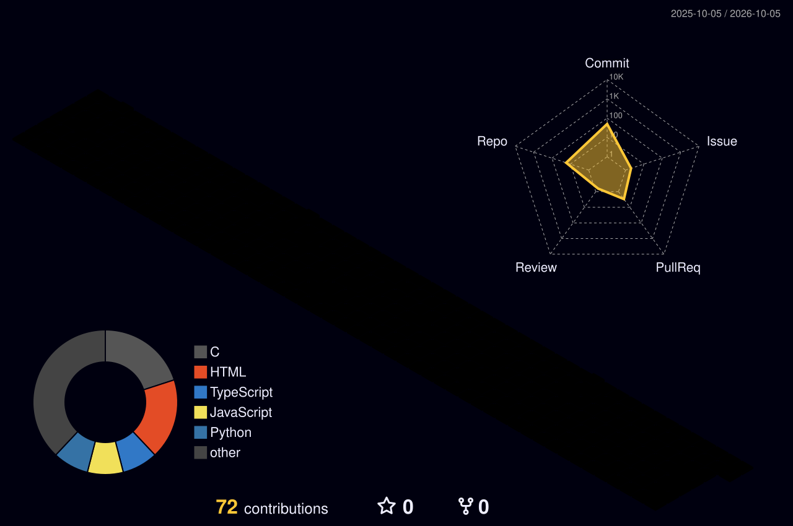

<!-- 

  

  
  
  
  

---

### About

**AI/ML Researcher & Systems Engineer** (Santa Cruz & SF Bay Area) — I architect distributed reinforcement learning infrastructure, multi-agent LLM systems, and high-throughput data processing engines. Currently completing my M.S. in Computer Science at **UC Santa Cruz** (3.93 GPA)[cite: 5, 6, 7, 8, 9]. Previously: automated sensor-testing pipelines at **Quanta Laboratories**[cite: 5, 6, 7, 8, 9], predictive demographic ML workflows at **Teens4Teens**[cite: 6, 7, 9, 11, 12], and cloud ETL engineering with Docker and PostgreSQL on AWS[cite: 5, 6, 7, 8, 9, 10, 11].

| | |
|---|---|
| **Currently** | Distributed RL experiments with Gymnasium & Stable-Baselines3 on Kubernetes at **AIEA Lab @ UCSC** · scalable LLM agent orchestration · stream processing |
| **Ask me about** | Agentic workflows & MCP · distributed RL compute · AST static code analysis · AST-driven automated refactoring · concurrent network servers in C · AWS ETL pipelines |
| **Reach me** | [YOUR_EMAIL@ucsc.edu](mailto:jkaleesw@ucsc.edu) · [LinkedIn](https://linkedin.com/in/jaisuraj-kaleeswaran) · [GitHub](https://github.com/jaisurajk) |

---

### 📊 Impact at a Glance

| Metric | System Impact & Proven Results |
|:---:|:---|
| **10x** | Faster inquiry triage & automated escalation via **Tri-City Agent** provider-agnostic LLM platform[cite: 5, 6, 7, 8, 9, 10]. |
| **90%** | Manual review effort eliminated via automated Streamlit parsing pipeline at **Quanta Laboratories**[cite: 5, 6, 7, 8, 9]. |
| **40%** | Reduction in RL experiment execution time across 1,000+ training runs on **Kubernetes** at **AIEA Lab**[cite: 6, 7, 8, 9, 10, 11]. |
| **100%** | Functional consistency achieved across 10K+ AST-evaluated test cases in **CodeSlob Cleanup**[cite: 5, 6, 7, 8, 9, 10, 11]. |
| **1,000+** | Playable procedural levels generated with GANs & evolutionary search (CMA-ES) in **GenAI Mario**[cite: 5, 6, 7, 8, 9, 10]. |
| **10x / 75%** | Throughput improvement and latency reduction engineered on a concurrent **Linux HTTP Server** in C[cite: 6, 7, 11, 12]. |

---

### Career & Research

* **AI Researcher @ AIEA Lab (UC Santa Cruz)** *(Mar 2025 – Present)*[cite: 5, 6, 7, 8, 9, 10, 11, 12]  
  * Led a team of 3 designing RL experiments using **Gymnasium & Stable-Baselines3** to improve agent reward by **35%** in autonomous vehicle environments[cite: 5, 6, 7, 8, 9, 10, 11, 12].  
  * Architected distributed training infrastructure on **Kubernetes**, cutting turnaround by **40%** and improving compute utilization by **25%** across 1,000+ batch runs[cite: 6, 7, 8, 9, 10, 11].  
  * Built 10+ reproducible evaluation metrics, reducing debugging cycles by **30%**[cite: 5, 6, 7, 8, 9, 10, 11].

* **Software Engineer Intern (Python) @ Quanta Laboratories** *(Dec 2025 – May 2026)*[cite: 5, 6, 7, 8, 9]  
  * Owned end-to-end data ingestion & parsing system for environmental stress testing across 40 chambers, processing **60K+ records** into ML-ready datasets[cite: 5, 6, 7, 8, 9].  
  * Built interactive **Streamlit** applications automating analysis workflows and cutting manual inspection effort by **90%**[cite: 5, 6, 7, 8, 9].

* **AI/ML Engineer Intern @ Teens4Teens** *(Jun 2025 – Sep 2025)*[cite: 9, 12]  
  * Architected scalable data pipelines using **Python, GeoPandas, Apache Airflow, and AWS S3**, increasing throughput **3x** on 60K+ records[cite: 6, 7, 9, 11].  
  * Trained Random Forest regression models (87% accuracy) and built geovisualization heatmaps across 30+ regions, boosting allocation coverage by **20%**[cite: 6, 7, 8, 9, 10, 11, 12].

* **Data Engineering Fellow @ Data Engineering Bootcamp** *(Jun 2024 – Aug 2024)*[cite: 5, 6, 7, 8, 9, 10, 11, 12]  
  * Engineered hourly ETL pipelines processing 10K+ SFO crime records using Python, REST APIs, and **PostgreSQL on AWS RDS**[cite: 5, 6, 7, 8, 9, 10, 11].  
  * Containerized services with **Docker** and deployed on **AWS EC2/S3**, cutting data delivery latency by **35%** and query time by **40%**[cite: 5, 6, 7, 8, 9, 10, 11].

---

### Skills & Tooling

  
  
  
  
  
  
  
  

| Domain | Core Stack & Technologies |
|:---|:---|
| **AI / ML & Agents** | PyTorch, TensorFlow, Scikit-Learn, Gymnasium, Stable-Baselines3, Claude API, Gemini API, RAG, MCP, LangChain, Multi-Agent Evals[cite: 5, 6, 7, 8, 9, 10] |
| **Languages** | Python, TypeScript, JavaScript, C++, C, Java, SQL, HTML/CSS, R[cite: 5, 6, 7, 8, 9, 10, 11, 12] |
| **Data & Cloud Infra** | AWS (S3, RDS, EC2), GCP, Docker, Kubernetes, Apache Airflow, PostgreSQL, Streamlit, Linux, CI/CD[cite: 5, 6, 7, 8, 9, 10, 11] |
| **Systems & Core** | Concurrency (Mutexes, Semaphores, RWLocks), AST Static Analysis, Distributed Training, REST APIs[cite: 5, 6, 7, 8, 9, 10, 11, 12] |

---

### Featured Projects

  
  

* **[Tri-City Agent](https://github.com/jaisurajk)** — Full-stack LLM triage platform (Node.js/Express, Claude & Gemini API) classifying community inquiries, routing cases, and speeding emergency escalation by **10x**[cite: 5, 6, 7, 8, 9, 10].
* **[CodeSlob Cleanup](https://github.com/jaisurajk)** — Python AST static analysis engine evaluating Cyclomatic Complexity and nesting depth across 1K+ LoC, leveraging Gemini-powered agents to autonomously refactor code with **100% verified functional equivalence** across 10K+ runs[cite: 5, 6, 7, 8, 9, 10, 11].
* **[GenAI Mario Levels](https://github.com/jaisurajk)** — End-to-end procedural ML system using PyTorch, GANs, and CMA-ES evolutionary search to autonomously generate **1,000+ playable levels** backed by 20+ fitness functions[cite: 5, 6, 7, 8, 9, 10].
* **[Multi-Threaded HTTP Server](https://github.com/jaisurajk)** — High-performance concurrent Linux server in C implementing mutexes, semaphores, and reader-writer locks, reducing latency by **75%** with a **10x throughput lift**[cite: 6, 7, 11, 12].

---

### GitHub Activity & Analytics

  
  

 

  

---

### Let's Collaborate

Distributed AI/ML infrastructure, agentic LLM systems, or computer vision — if you're building in this space, [email me](mailto:jkaleesw@ucsc.edu) or connect on [LinkedIn](https://linkedin.com/in/jaisuraj-kaleeswaran). -->

---

  <!-- Animated Typing Header (Reliable & GitHub Native) -->
  

  

    
    
    
  

  

    <b>M.S. in Computer Science @ UC Santa Cruz</b> &bull; B.S. in Computer Science @ UCSC 
    Focused in <b>Generative AI / Agentic Systems, Systems Programming (C/C++), Reinforcement Learning, Distributed ML Infrastructure, Autonomous AI Agents, Data Engineering, & Cloud Infrastructure</b>.
  

---

### Featured Projects

<table>
  <tr>
    <td width="50%">
      <h3 align="center">NitroRing: Silicon Command Queue & DMA Runtime</h3>
      

        
        
        
        
        
      

      <ul>
        <li>Userspace accelerator runtime emulating lock-free command queues, DMA, MMIO doorbells, and SIMD execution.</li>
        <li>Reduced command submission latency by <b>85%</b> across execution cycles.</li>
        <li>Implemented acquire/release atomics, 64-byte cache alignment, and zero-copy memory transfers processing <b>1,000 asynchronous commands</b> with zero dropped requests or deadlocks.</li>
      </ul>
    </td>
    <td width="50%">
      <h3 align="center">Tri-City Agent</h3>
      

        
        
        
        
        
      

      <ul>
        <li>Full-stack triage platform orchestrating LLM workflows to classify and route animal shelter inquiries.</li>
        <li>Automated routine community requests while escalating emergency cases <b>10x faster</b>.</li>
        <li>Automated repetitive shelter tasks with an LLM-powered agent, saving <b>10+ hours/week</b> and freeing <b>$10K/year</b> in staff capacity.</li>
      </ul>
    </td>
  </tr>
  <tr>
    <td width="50%">
      <h3 align="center">Multi-Threaded HTTP Server</h3>
      

        
        
        
        
      

      <ul>
        <li>High-throughput concurrent HTTP server handling <b>1K+ client requests</b> across 4+ worker threads.</li>
        <li>Synchronized execution using <b>mutexes, semaphores, and reader-writer locks</b> with 0 data races across 1,000+ runs.</li>
        <li>Achieved a <b>10x throughput improvement</b> and <b>75% latency reduction</b> through optimized file I/O and scheduling.</li>
      </ul>
    </td>
    <td width="50%">
      <h3 align="center">CodeSlob Cleanup</h3>
      

        
        
        
        
      

      <ul>
        <li>Static analysis engine across 1K+ LoC (Cyclomatic Complexity, nesting depth) reducing manual review by <b>40%</b>.</li>
        <li>Built an autonomous AI agent to automate Gemini-written code refactoring, boosting modularity by <b>35%</b>.</li>
        <li>Validated equivalence via <b>10K+ test runs</b> with <code>ThreadPoolExecutor</code>, achieving 100% behavioral consistency.</li>
      </ul>
    </td>
  </tr>
</table>
<table>
  <tr>
<td width="50%">
      <h3 align="center">GenAI Mario Level Generation</h3>
      

        
        
        
        
      

      <ul>
        <li>Procedural content generation system autonomously generating <b>1,000+ playable Mario levels</b>.</li>
        <li>Designed <b>20+ fitness/evaluation functions</b> optimizing level playability and accelerating search convergence by <b>30%</b>.</li>
        <li>Parallelized 100+ training/evaluation experiments with multiprocessing, cutting turnaround by <b>60%</b>.</li>
      </ul>
    </td>
      </tr>
</table>

---

### Experience & Leadership Highlights

* **Software Engineer Intern (Python) @ Quanta Laboratories** (*Dec 2025 – May 2026 | Santa Clara, CA*)
  * Owned end-to-end development of a Python-based data ingestion & parsing system for environmental testing across 40 test units, automating **60K+ records** and improving workflow tracking by **5x**.
  * Designed a Streamlit application to automate data-review workflows, reducing manual review effort by **90%**.

* **AI/ML Engineer Intern @ Teens4Teens** (*Jun 2025 – Sep 2025 | Boston, MA*)
  * Architected scalable data pipelines using Python, Airflow, and AWS S3 on **60K records**, increasing throughput by **3x**.
  * Streamlined preprocessing & validation workflows across 10 datasets containing **100K+ records each**, reducing model prediction error by **15%** while achieving **87% accuracy**.

* **AI Researcher @ AIEA Lab** (*Mar 2025 – Present | Santa Cruz, CA*)
  * Led a team of 3 building and optimizing Python-based distributed ML infrastructure with Kubernetes, increasing compute utilization by **25%** across **1,000+ batch runs**.
  * Orchestrated reinforcement learning experiments using Gymnasium & Stable-Baselines3, improving agent reward by **35%**.
  * Built **10+ automated evaluation tools** to improve reproducibility by 40% and cut debugging time by 30%.

* **Data Engineering Fellow @ Data Engineering Bootcamp** (*Jun 2024 – Aug 2024 | Sydney, Australia*)
  * Engineered automated ETL pipeline to process **10K+ SFO crime records hourly** using Python, SQL, and REST APIs.
  * Refined PostgreSQL schemas and indexing strategies on AWS RDS, reducing average query latency by **40%**.
  * Containerized 10 core services with Docker and deployed on AWS EC2/S3, reducing data delivery latency by **35%**.

---

### Certifications

* **Claude With the Anthropic API, AI Fluency: Framework & Foundations** (*Jul 2026*)
  * Mastered prompt engineering, tool use/function calling, structured JSON output extraction, and agentic workflows using Claude models.
  * Implemented multi-turn conversational agents with stateful context management and latency-optimized API streaming.

* **AWS Cloud Practitioner Essentials** (*Jun 2026*)
  * Validated core cloud infrastructure concepts across compute (**EC2**), storage (**S3**), relational databases (**RDS**), and networking.
  * Gained proficiency in IAM security policies, cloud economics, shared responsibility security models, and distributed deployment architectures.

---

### Technical Skills

| Category | Technologies & Tools |
| :--- | :--- |
| **Languages** |         |
| **AI, ML & Agents** |        |
| **Data & Cloud Infra** |       |
| **Frameworks & Web** |      |

### GitHub Activity & Analytics

  

 

  

<!-- 

  
  <!--  -->

 

  

  

---

  ⚡ Constantly experimenting with low-level acceleration, distributed RL, and cloud-native systems.

